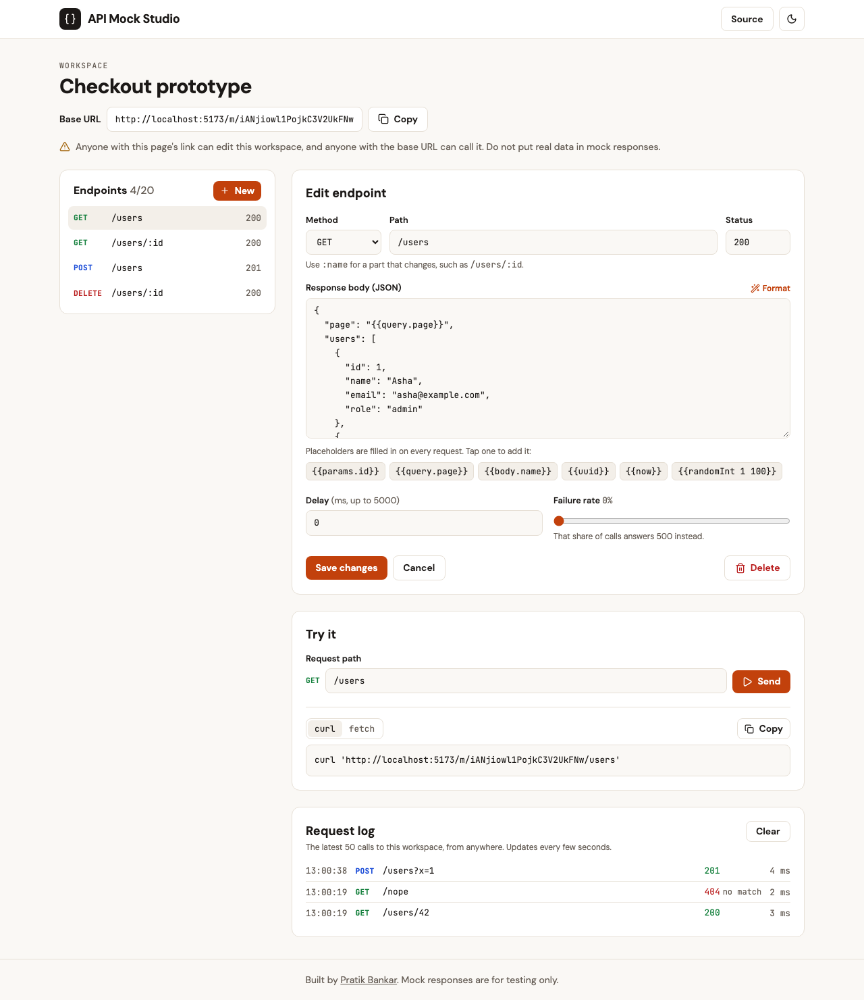

# API Mock Studio

Design fake REST endpoints in your browser and call them from anywhere. Build and test a
frontend before the real backend exists.

**Live demo:** https://api-mock-studio-pratik.vercel.app



## What it does

- **Define endpoints** with a method, a path such as `/users/:id`, a status code and a JSON body.
- **Call them for real.** Every workspace gets its own base URL that answers from any app,
  script or browser, with CORS open.
- **Living responses.** Placeholders are filled in on each request:

  | Placeholder | Becomes |
  |---|---|
  | `{{params.id}}` | The `:id` part of the path |
  | `{{query.page}}` | A query string value |
  | `{{body.name}}` | A field of the JSON the caller sent |
  | `{{uuid}}` | A new random id |
  | `{{now}}`, `{{timestamp}}` | The current time, as ISO text or milliseconds |
  | `{{randomInt 1 100}}` | A random whole number |

- **Slow and flaky on demand.** Add a delay, or a failure rate so some calls answer 500, to
  see how your app copes with a bad network.
- **Request log.** See every call that reached your mocks: what was asked, which endpoint
  matched, and what was returned.
- **Try it and copy it.** Send a test request from the page, and copy a ready `curl` or
  `fetch` snippet.
- **No sign-up.** A workspace is private to its link.

## Example

With the sample Users API in a workspace whose base URL is `https://.../m/<workspace>`:

```bash
curl https://.../m/<workspace>/users/42
# {"id":"42","name":"Asha","email":"asha@example.com","role":"admin","lastSeen":"2026-10-05T07:30:19.402Z"}

curl -X POST https://.../m/<workspace>/users \
  -H 'Content-Type: application/json' -d '{"name":"Ravi","email":"r@example.com"}'
# {"id":"c527795b-...","name":"Ravi","email":"r@example.com","createdAt":"2026-10-05T07:30:38.407Z"}
```

## How it works

```
Browser (React)  -- /api/...            manage workspaces and endpoints
Any client       -- /m/<workspace>/...  serve the mocks
                       |
                 Express on one Vercel function
                       |
                    MongoDB
```

Two design points worth reading in the code:

- **Templating cannot break the response.** A stored body is parsed as JSON first and
  placeholders are filled in on the parsed value, never by editing text. Whatever a caller
  puts in a path, query or body, the output is valid JSON and cannot gain extra fields. A
  string that is exactly one placeholder keeps the value's type, so `"{{body.age}}"` returns a
  number. See [`server/lib/template.ts`](server/lib/template.ts).
- **The most specific path wins.** When `/users/me` and `/users/:id` both match, the one with
  more literal parts is chosen, whatever order they were created in. See
  [`server/lib/paths.ts`](server/lib/paths.ts).

## Tech stack

| Layer | Tools |
|---|---|
| Client | React 19, TypeScript, Vite, Tailwind CSS, React Router |
| Server | Node.js, Express, TypeScript, Mongoose, Zod |
| Data | MongoDB (with TTL indexes for automatic cleanup) |
| Tests | Vitest, Supertest, in-memory MongoDB |
| Hosting | Vercel (static client and one serverless function) |

## Run it locally

Needs Node.js 20 or newer and nothing else; an in-memory database is used by default.

```bash
npm install
npm run dev        # client on http://localhost:5173, API on http://localhost:4000
```

| Command | What it does |
|---|---|
| `npm run dev` | Client and API with reload |
| `npm test` | All tests |
| `npm run typecheck` | Type check client and server |
| `npm run lint` | ESLint |
| `npm run build` | Production build of the client |

To keep data between restarts, copy `.env.example` to `.env` and set `MONGODB_URI`.

## API

| Method and path | Purpose |
|---|---|
| `POST /api/workspaces` `{ name?, template? }` | Create a workspace (`template: "users"` adds samples) |
| `GET /api/workspaces/:id` | A workspace and its endpoints |
| `POST /api/workspaces/:id/endpoints` | Add an endpoint |
| `PUT /api/workspaces/:id/endpoints/:eid` | Change an endpoint |
| `DELETE /api/workspaces/:id/endpoints/:eid` | Remove an endpoint |
| `POST /api/workspaces/:id/templates/:name` | Add a starter set |
| `GET`, `DELETE /api/workspaces/:id/logs` | Read or clear the request log |
| `ANY /m/:id/...` | Call a mock |

Errors always look like `{ "error": { "code": "...", "message": "..." } }`.

## Limits and safety

- **Mock responses are always JSON**, sent with `nosniff`, so the service cannot be used to
  host web pages or scripts.
- **A workspace link is its only credential.** The id is 128 random bits. Anyone with the link
  can edit the workspace, like a shared document link, and the app says so.
- **Limits:** 20 endpoints per workspace, 20 KB per response body, delays up to 5 seconds,
  the latest 50 log entries per workspace.
- **Automatic cleanup:** workspaces unused for 30 days and log entries older than 7 days are
  removed by MongoDB TTL indexes.
- **Rate limits are best effort.** They are counted in memory per server instance, which is
  approximate on serverless hosting.

## License

MIT
